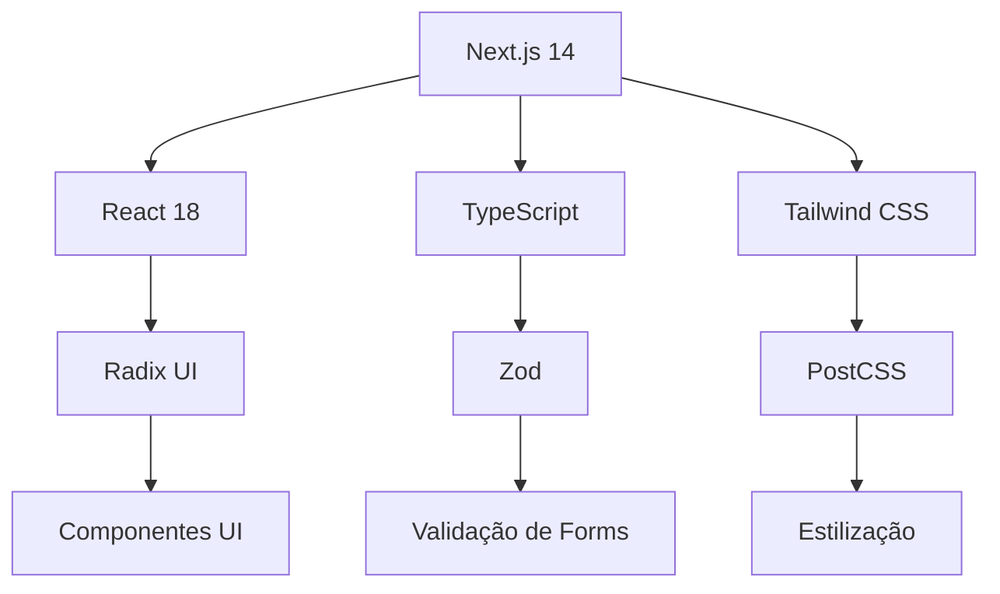
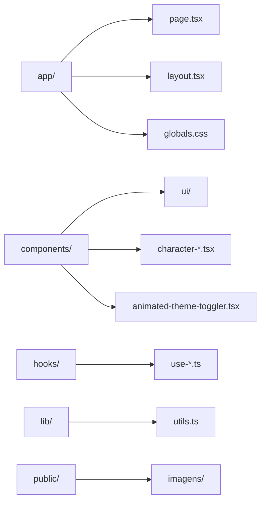
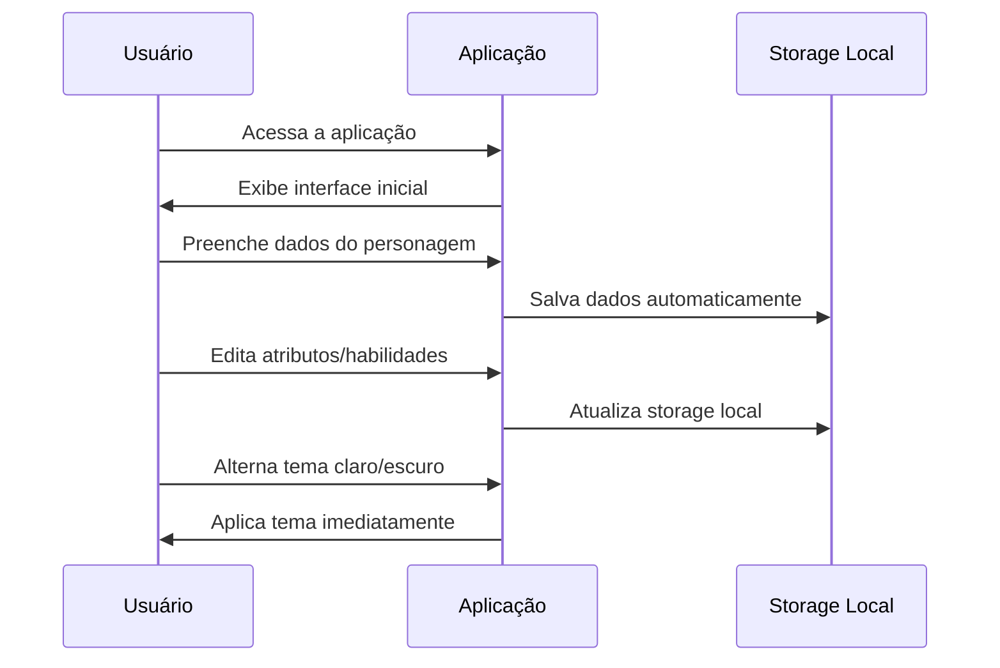
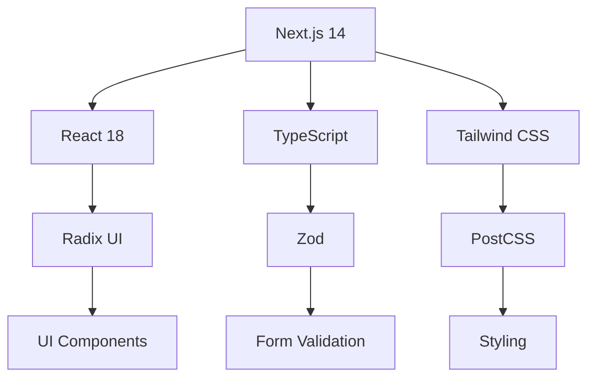
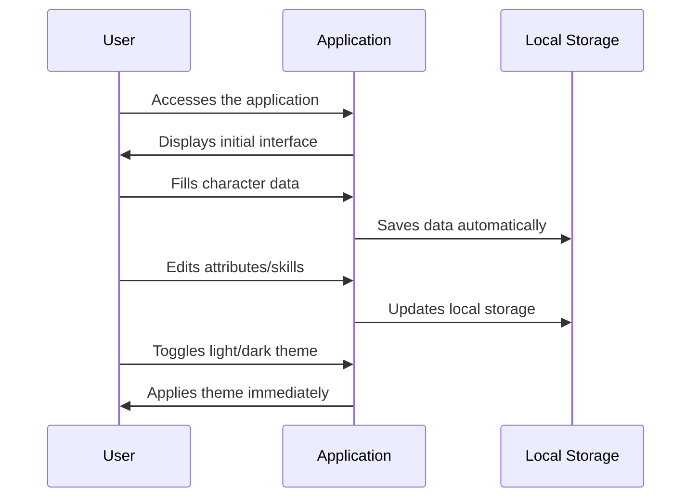

# Sheet Call of Cthulhu

<p align="center">
  
</p>

<p align="center">
  <strong>Ficha de Personagem para Call of Cthulhu RPG</strong><br>
  Aplicação web moderna para gerenciar fichas de personagem do RPG Call of Cthulhu
</p>

---

## 🇧🇷 Versão em Português

### 📋 Sobre o Projeto

Este projeto é uma aplicação web moderna desenvolvida em Next.js para criar e gerenciar fichas de personagem para o RPG de terror Lovecraftiano "Call of Cthulhu". A aplicação oferece uma interface intuitiva e responsiva para jogadores e mestres de jogo.

### 🚀 Funcionalidades

- ✅ Criação e edição de fichas de personagem
- ✅ Sistema de atributos e habilidades completo
- ✅ Gerenciamento de sanidade e pontos de vida
- ✅ Interface responsiva e tema claro/escuro
- ✅ Armazenamento local de dados
- ✅ Validação de formulários integrada

### 🛠️ Stack de Tecnologias



### 📁 Estrutura do Projeto



### 📦 Instalação

1. Clone o repositório:
```bash
git clone https://github.com/SEU_USUARIO/sheetCallOfCthulhu.git
cd sheetCallOfCthulhu
```

2. Instale as dependências:
```bash
npm install
# ou
pnpm install
# ou
yarn install
```

3. Execute o servidor de desenvolvimento:
```bash
npm run dev
# ou
pnpm dev
# ou
yarn dev
```

4. Abra [http://localhost:3000](http://localhost:3000) no seu navegador.

### 🎮 Como Usar



### 🏗️ Scripts Disponíveis

```bash
npm run dev          # Inicia servidor de desenvolvimento
npm run build        # Build para produção
npm run start        # Inicia servidor de produção
npm run lint         # Executa linting
```

### 🤝 Contribuindo

1. Faça um fork do projeto
2. Crie sua feature branch (`git checkout -b feature/nova-funcionalidade`)
3. Commit suas mudanças (`git commit -m 'Adiciona nova funcionalidade'`)
4. Push para a branch (`git push origin feature/nova-funcionalidade`)
5. Abra um Pull Request

### 📄 Licença

Este projeto está sob a licença MIT. Veja o arquivo [LICENSE](LICENSE) para mais detalhes.

---

## 🇺🇸 English Version

### 📋 About the Project

This project is a modern web application developed in Next.js for creating and managing character sheets for the Lovecraftian horror RPG "Call of Cthulhu". The application provides an intuitive and responsive interface for players and game masters.

### 🚀 Features

- ✅ Character sheet creation and editing
- ✅ Complete attributes and skills system
- ✅ Sanity and hit points management
- ✅ Responsive interface with light/dark theme
- ✅ Local data storage
- ✅ Integrated form validation

### 🛠️ Tech Stack



### 📁 Project Structure


### 📦 Installation

1. Clone the repository:
```bash
git clone https://github.com/YOUR_USERNAME/sheetCallOfCthulhu.git
cd sheetCallOfCthulhu
```

2. Install dependencies:
```bash
npm install
# or
pnpm install
# or
yarn install
```

3. Run the development server:
```bash
npm run dev
# or
pnpm dev
# or
yarn dev
```

4. Open [http://localhost:3000](http://localhost:3000) in your browser.

### 🎮 How to Use



### 🏗️ Available Scripts

```bash
npm run dev          # Start development server
npm run build        # Build for production
npm run start        # Start production server
npm run lint         # Run linting
```

### 🤝 Contributing

1. Fork the project
2. Create your feature branch (`git checkout -b feature/new-feature`)
3. Commit your changes (`git commit -m 'Add new feature'`)
4. Push to the branch (`git push origin feature/new-feature`)
5. Open a Pull Request

### 📄 License

This project is licensed under the MIT License. See the [LICENSE](LICENSE) file for more details.

---

<p align="center">
  Made with ❤️ for Call of Cthulhu RPG community
</p>
